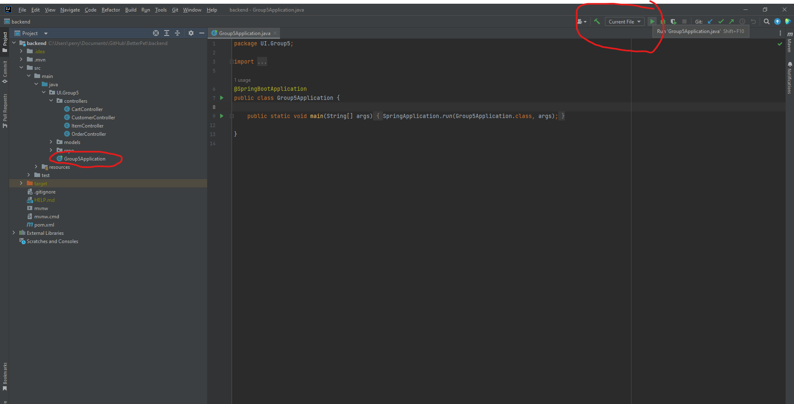

Open the Group5Application.java file.

Click run on the top right of the screen.

You will be able to tell if the application is running if the console says the following:

Tomcat started on port(s): 8090 (http) with context path ''

Started Group5Application in 4.891 seconds (process running for 6.195)